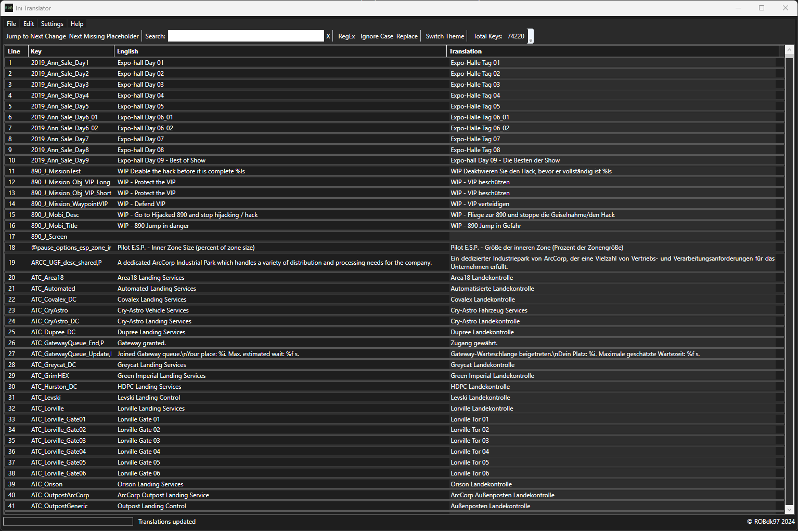

# IniTranslator

**IniTranslator** is a powerful WPF desktop application designed for easy comparison, editing, and management of INI file translations, commonly used in software localization. With advanced features and an intuitive UI, it simplifies synchronization between English and translated INI files.

---

## Table of Contents

- [Features](#features)
- [Installation](#installation)
  - [Prerequisites](#prerequisites)
  - [Download Options](#download-options)
- [Usage](#usage)
  - [General Usage](#general-usage)
  - [Keyboard Shortcuts](#keyboard-shortcuts)
  - [Menu Options](#menu-options)
  - [Toolbar Functions](#toolbar-functions)
- [Contributing](#contributing)
- [License](#license)
- [Contact](#contact)

---

## Features

- **Multi-Language INI File Management**  
  Open, edit, and compare English and translated INI files side-by-side. Extract INI files directly from *Star Citizen* game archives for localization tasks.
  
- **Search & Filtering**  
  Utilize regex and case-insensitive search to quickly locate entries in large files.

- **Placeholder Validation**  
  Automatically detect and resolve mismatched or missing placeholders.

- **Backup System**  
  Create, manage, and restore backups effortlessly.

- **Translation API Support**  
  Leverage Google Translate or DeepL APIs for instant translations.

- **Version Comparison**  
  Identify differences between current and older INI file versions.

- **Customizable UI**  
  Switch between Light and Dark themes; save preferences like window size and position.

- **Efficient Navigation**  
  Navigate using intuitive keyboard shortcuts and jump to lines or specific entries with ease.

- **Comprehensive Editing Tools**  
  Replace text using regex, copy English values to translation fields, and manage structured clipboard data.

- **File System Integration**  
  Open INI files directly via Windows Explorer or extract INI files from game archives.

- **Help & Documentation**  
  In-app guidance with keyboard shortcuts, tooltips, and GitHub repository links.

---

## Installation

### Prerequisites

- **.NET 8 Desktop Runtime**: Ensure the runtime is installed. The setup file will handle installation if needed.

### Download Options

1. **Setup Installer**  
   Install the application with a guided setup, including desktop/start menu entries and runtime installation.  
   [Download Setup](https://github.com/ROBdk97/IniTranslator/releases/latest/download/IniTranslaterSetup.msi)

2. **Direct Executable**  
   For advanced users who already have the runtime installed.  
   [Download Executable](https://github.com/ROBdk97/IniTranslator/releases/latest/download/Release.zip)

---

## Usage

### General Usage

- **Open Files**: Load English and translated INI files via `File > Open` or `Ctrl + O`.
- **Edit Translations**: Modify translation entries directly in the interface.
- **Translate**: Use the configured API via `Edit > Translate` or `Ctrl + T`.
- **Validate Placeholders**: Locate mismatched placeholders using the toolbar.
- **Save Work**: Save your changes with `Ctrl + S`.
- **Restore Backups**: Reload backups from `File > Load Backup`.

### Keyboard Shortcuts

- **Ctrl + O**: Open INI files  
- **Ctrl + S**: Save translations  
- **Ctrl + T**: Translate selected entries  
- **Ctrl + J**: Jump to a specific line  
- **F3**: Navigate to the next change  
- **F4**: Jump to mismatched placeholders  

### Menu Options

#### File  
- **Open...**: Load English and translated INI files.  
- **Extract from Game**: Retrieve English INI files from *Star Citizen* archives.  
- **Save/Reload**: Manage translations.  
- **Load Backup**: Restore previous versions.  

#### Edit  
- **Copy/Paste**: Manage clipboard data.  
- **Replace**: Find and replace text.  
- **Translate**: Automate translations.  

#### Tools  
- **Settings**: Configure API keys, themes, and more.  
- **Theme**: Toggle between Light and Dark modes.  

---

## Toolbar Functions

- **Search**: Filter translations using keywords or regex.  
- **Jump to Changes**: Navigate directly to updated translations.  
- **Placeholder Validation**: Highlight entries with mismatched placeholders.  
- **Progress Indicators**: Monitor tasks in real-time.  

---

## Contributing

We welcome contributions! To contribute:

1. **Fork** the repository.  
2. Create a branch: `git checkout -b feature/YourFeatureName`.  
3. Commit changes: `git commit -m "Description of changes"`.  
4. Push to your branch: `git push origin feature/YourFeatureName`.  
5. Open a **Pull Request**.

For significant changes, start a discussion by opening an issue.

---

## License

This project is licensed under the [MIT License](https://github.com/ROBdk97/IniTranslator/blob/main/LICENSE).

---

## Contact

- **GitHub Repository**: [IniTranslator](https://github.com/ROBdk97/IniTranslator)  
- **Issues & Feature Requests**: Open an issue on GitHub  
